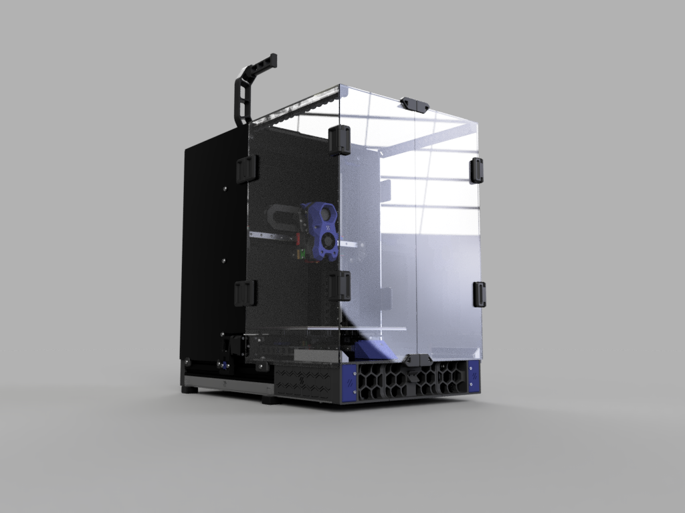

# Anycubic Vyper to Voron Switchwire Conversion Ver1

This repository contains files and information about conversion of Anycubic's one of the popular and affordable printers, Anycubic Vyper, to Voron Switchwire.
This mod is based on DaRk_dOg's amazing [Ender_SW conversion](https://github.com/boubounokefalos/Ender_SW) and official designs from [Voron's Switchwire repository](https://github.com/VoronDesign/Voron-Switchwire/). The idea of this conversion was generally to provide full CoreXZ motion with Direct Drive and linear rails for Vyper. Additionally enclosing printer in a reasonable way to let print heat resistant plastics with all electonics outside of the printer. Because of the CoreXZ mounting system the build space is around 242x250x255 mm.

## What's been changed

* Y-axis
    * Y-carriage got major overhaul. It is still based on the Ender_SW project, but it was widened to fit 6040 T-shaped extrusion.
    * Y endstop was moved to the carriage. It allows the bed to park on the front, just like in original Switchwire.
    * Added ADXL mounts to the left carriage inspired by Stealthburner mounts. Different sensor hole sizes are available. Spacers from original Stealthburner ADXL mounts are required to install sensor on the mount.
    * Y-carriage is compatible with stock bed assembly including it's 12 screws mounts. There is enough clearance for the screws to not interfere with the assembly.
    * Y-idler has been widened to cover entire 6040 T-shaped extrusion and includes a small notch that helps triggering the Y-endstop on the carriage.
    * Designed small Y-axis stoppers that fit both 300 mm and 350 mm rails mounted on Y-axis.
    * Added Y-axis motor mount that extends the Y-axis to properly mount the motor on rear grill (based on Ender_SW EV2 variant). it also covers extrusion holes.
* XZ-Axis
    * Adjusted XZ-blocks to fit 300 mm linear rail on 330mm X-axis assembly. It follows original Switchwire design and uses 2x M5x16 screws to mount to the front of extrusion.
    * Created aditional variant of XZ-blocks to fit 2020 T-slot extrusion (if you bought one, like me).
    * Created new and bigger Z-axis stoppers that use M5x10 to mount to the frame to match Keybak mount sizes.
    * Keybak mount got adjusted and resized to fit 4020 side extrusion and serves as Z stop.
* Frame extensions
    * Rear extensions got resized to match Vyper's size.
    * Front extensions now allow mounting 2x 6020 fans on the front of the printer with small mount that uses 2 threaded inserts and 2x M3x8 screws. To mount 6020 fan you need 2x M3x25 screws.
* Grills
    * Front- and Rear- middle grills got adjusted to match the size of a Vyper.
    * Added rear left grill for stock power outlet from Fizzytech's take on their, also amazing, "[FT Vyperwire](https://github.com/fizzystech/vyperwire)" project.
    * 
* Electronics
    * Added Anycubic TriGorilla v0.0.6+ frame mount.
    * Created small PSU mounts that allow to mount PSU on either front, or back of the frame, depending on preference.
* Panels
    * Resized all panels to match Vyper's size.
    * Light bars got resized to match Vyper's size.
* Misc
    * Added hole cover for frame cross-section the 54mm one is for C revision and onwards printers, whereas smaller one is for A and B revision ones.

## What can be salvaged

Here are the parts that can be salvaged for building the conversion:
* Frame, excluding top and X-axis extrusion (you have to replace them)
* Possibly stepper motors, but they may not have enough torque, so YMMV
* Entire bed assembly
* Mainboard - you can "enable" UART mode with some soldering work without any problems
* Extruder - Yes! It's a BMG clone, so the gears should be fitting to Clockwork 2. Unfortunately I had some problems with the size of the bearings, so YMMV
* PSU - It's a knock-off MeanWell LRS-350-24
* Heatbreak 4010 fan
* Screws, bolts and PTFE tube

## BOM Changes

The BOM is the same for Official Switchwire with Ender_SW changes. Also include the things below.

|Name|Qty|Note|
|---|---|---|
|M3x16 BHCS (ISO 7380-2)|2|XZ-blocks mount|
|M3x8 SHCS (DIN 912)|at least 6|ADXL and front fan mounts|
|M3x25 SHCS (DIN 912)|4|Optional. front fan mounts|
|M2x10 self-tapping screws|2|ADXL mount|
|M5x10 BHCS (ISO 7380-2)|at least 4|Z rail stops mounts|
|M3x5x4 threaded inserts|at least 6|ADXL mount and front fans mount. The same inserts as in Voron specs|
|300 mm MGN12H rails|3|X and Y axes. You can use 2x 350 mm for Y axis if you have them, otherwise buy cheaper option|
|350 mm MGN12H rails|2|Z axis. See note above|
|330 mm 2020 V-slot extrusion|1| X-axis replacement. If you can, buy 2 350 mm extrusions and cut one to the size with a saw|
|350 mm 2020 V-slot extrusion|1| Top frame. See note above|
|6020 GDSTIME or Sunon Fans|2|Optional. For front fan mounts|

## Printing options

Follow official VoronDesign guides and suggestions on how to print your parts. For the toolhead STLs, use official [Voron Stealthburner]() release. 

## Credits
* [Voron Design](https://vorondesign.com/) - for official Voron Switchwire project and STLs
* DaRk_dOg (aka [boubounokefalos](https://github.com/boubounokefalos)) - for amazing [Ender_SW conversion](https://github.com/boubounokefalos/Ender_SW)
* [Fizzytech](https://github.com/fizzystech) and their Discord - for some ideas and files taken from their modded conversion
* You - for reaching out this far :) Thanks!

# License

The files are distributed under GNU GPL v3.0 license.
